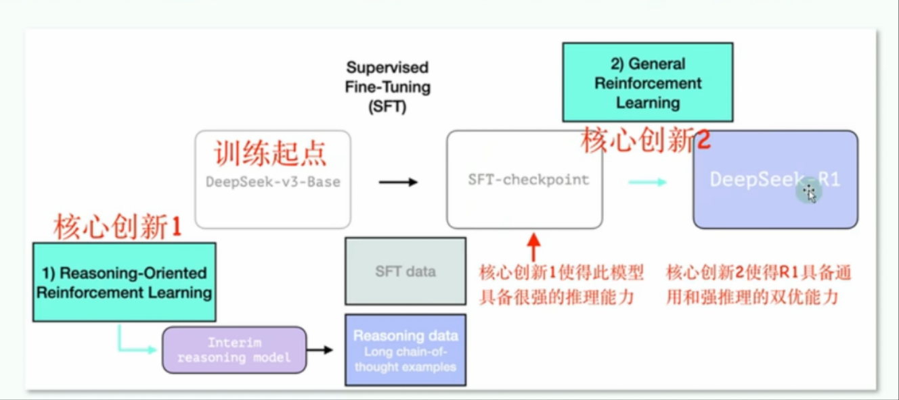
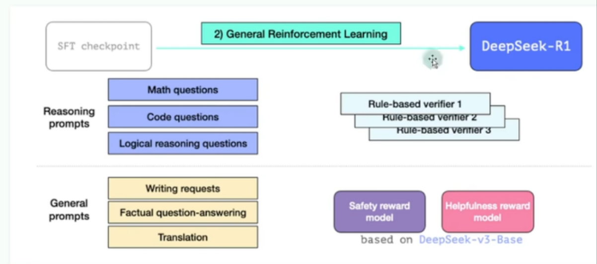

# DeepSeek使用教程

## 指令模型和推理模型的区别
* 指令模型
    * 需要引导Ai去思考，你说一步它做一步
    * DeepSeek-V3、GPT-4O、豆包、Qwen2.5、Liama-3.1
* 推理模型
    * 直接问，它会自己思考
    * DeepSeek-R1、OpenAi-o1、OpenAi-O3mini

## 几个按钮的作用

### 深度思考
* 未选择：使用的是v3模型
* 选择：使用的是R1模型

### 联网搜索
* 未选择：使用的是23年12月之前的数据
* 选择：可以搜索到23年12月之后的数据

### 上传附件
* 可以上传给DeepSeek，针对该文件进行提问

## 使用技巧

### 提示词

* 本质：表达
* 两个关键问题
    * 我是否真正理清了脑海中的想法
    * 我是否能通过文字准确传达这个想法

### 推理模型的提示词共识

* 当询问一个AI知道（互联网能查到）的问题时，不要引导Ai的思维，直接提问

* 给AI足够多的背景信息
    * 干什么？
    * 给谁干？
    * 目的是？
    * 约束是？
    * 例：我要写一个“如何理解爱因斯坦相对论”相对论的科普文章，给中小学生看，希望能通俗易懂、内容充实、幽默，且觉得非常实用，不要太AI或枯燥

* 巧妙利用乔哈里视窗
    * 普通人知道，AI也知道的-简单说
        * 推荐：我是一名小学生，请...
        * 不推荐：我是一名小学生，没有学过物理、化学，听不懂高深的专业词汇，请...
    * 你知道，AI不知道的-喂模式
        * 先给AI投喂相关知识，让AI理解，再提问
        * 解释
            * 例：平移副框是安装在平移扇框上的一根型材，它的长度与所在扇框的长度相同，请帮生成平移副框实体
        * 定义行业术语字典
            * 术语名-含义
        * RAG（检索增强生成）技术
            * 联网搜索
            * 上传附件
    * 普通人不知道，AI知道的-提问题
        * 量子物理是什么？
    * 你和AI都不知道的-开放聊
        * 例：特朗普和泽连斯基争吵，美乌矿产协议暂未签署，释放了什么信号？

### 技巧总结

1. 要求明确
    * 用人话清晰表达出你的需求
    * 你是谁 + （背景信息） + 你想得到什么？
    * 例：我是男性，目前身高175，体重160斤，每天运动量是步行1公里，我希望1月内瘦到150斤，请帮我制定一个运动及饮食减肥计划
    * 例：我是一个科普博主，需要写一篇关于全球变暖对农业影响的科普文章，800字左右，语言通俗易懂
    * 例：我是一个编程小白，想从零开始学python，请给我一个3个月的学习计划，并推荐适合初学者的资源

2. 不要定义过程
    * 错误示例：请按以下步骤解答：方程3x + 5 = 20的解是多少？1. 列出方程的所有可能形式 2. 带入数值验证参数 3. 检查是否存在整数解的条件
    * 正确示例：方程3x + 5 = 20的解是多少？请给出求解过程

3. 明确受众
    * 说人话
    * 我是一个编程小白

4. 明确风格
    * 例：用小红书笔记的风格，写一篇长沙三日游攻略

5. 补充额外信息
    * 例：平移副框是安装在平移扇框上的一根型材，它的长度与所在扇框的长度相同，请帮生成平移副框实体

6. 上下文的联系
    * R1能联系的上下文大概是3~4万中文字符，适用于文档分析、长对话等场景
    * 输入长度大概是2~4千字，需要拆解需求再提问

7. 清除记忆
    * 开启新对话
    * 加上：回复此条对话前，请忽略前面的所有对话

8. 思考过程比回答更重要
    * 思考过程能给你带来启发

9. 深度思考plus
    * 如果Ai的回答不够有深度，可以添加以下提示词，激发Ai进行反复思考
        * 请用辩证的思维或批判性思维思考问题
        * 请多角度的考虑问题
        * 请对你的回答复盘5次，论证你的回答

10. 复杂问题，分布拆解

### 避坑

1. 冗长提示词导致焦点偏移
    * 超过200字的问题描述可能导致焦点偏移，过度思考，甚至逻辑凌乱。

2. 避免复杂句式和模糊词语
    * 复杂的句式会增加Ai的理解负担
    * 模糊的词语目标不够明确

## 使用场景

1. 数学&物理

2. 代码能力
    * 代码编写、代码优化、分析和解释代码（加注释）、调试代码等

3. 写作&文案能力

4. 内容总结
    * 可以把会议、文章等内容给Ai总结

5. 指定输出格式
    * mermaid流程图、甘特图
        * 请帮我生成一份遵循mermaid语法的流程图/甘特图
        * 点击生成的流程图，复制
        * 粘贴到md文件中
    * Xmind
        * 请以xmind可以识别的markdown文本输出
        * 复制内容粘贴到markdown
        * 在xmind中导入
    * PPT
        * 请以文本形式给出ppt的详细内容
        * 打开kimi官网：[kimi-ppt助手] (https://kimi.moonshot.cn/kimiplus/conpg18t7lagbbsfqksg)
        * 将deepseek的输出内容复制到kimi的输入框中生成
    * svg

6. 日常生活
    * 生活中有问题就问它

7. 简历生成

8. 模拟面试
    * 我要去面试前端开发工程师了，该公司所需技术栈有html、css、js、es6、vue、react、node，请给我出10道相关的高频的面试题
    * 现在你是前端面试官，你在面试我，我来应聘的是前端工程师，技术栈包括html、css、js、es6、vue、react、node，请结合物品的技术栈范围向我提问。你问一个问题，就等我回答一个问它，我回答后，你要评价我的回答如何，有哪些地方不太对。然后再问下一个问题，现在可以开始了

# 部署deepseek

* 使用ollama
    * 官网：[ollama] (https://ollama.com/)
    * 下载并安装
    * 控制台输入`ollama -v`查看版本
* 下载并使用deepseek-r1(7b)
    * [选择model] (https://ollama.com/library/deepseek-r1)
    * 控制台运行：`ollama run deepseek-r1`
    * 直接在控制台聊天就行
* 使用客户端进行交互
    * 打开cherry-studio
    * 设置->模型服务->ollama->开启->选择本地部署的模型

# DeepSeek-R1的训练过程与原理

* 训练方法结合了`强化学习（RL）`与`监督微调（SFT）`创造了一种高效训练，高推理能力AI模型的方法
    
* 为了解决回复时语言混合，非推理任务回复效果差等问题，DeepSeek提出通用强化学习训练框架
    
## 训练过程

1. 冷启动阶段
    * 收集R1-Zero的输入，并进行人工标注和格式化
    * 使用带有长思维链（CoT）的few-shot prompting
    * 直接提示模型生成带有反思和验证的详细解答
2. 面向推理的强化学习
    * 为了解决训练过程中可能出现的语言混杂问题，引入语言一致奖励机制
3. 拒绝采样与监督微调
    * 利用训练好的RL模型进行拒绝采样，生成新的SFT数据，涵盖了其他领域的数据
    * RL模型（相当于考过年级第一的你）现在要做的是
        * 自己出一套模拟卷（生成候选数据）
        * 扔掉得分低于90的题目（拒绝低质量样本）
        * 只保留优质题目加入新题库（高质量SFT数据）
4. 面向全场景的强化学习
    * 第二阶段的强化学习训练，涵盖所有 类型的任务。此外，R1采用了不同的奖励信号和提示分布，针对不同的任务类型进行了优化
    * 列如
        * 对于数学、代码和逻辑推理等任务，采用基于规则的奖励
        * 对于开放式问答、创意写作等任务，则采用基于模型的奖励
* 总结
    * 中间推理模型生成
        * 通过推理导向的强化学习，直接生成高质量的推理数据（CoT示例），减少人工标注依赖
    * 通用强化学习优化
        * 基于帮助性和安全性奖励模型，优化推理与非推理任务表现，构建通用性强的模型
    * 最终成果
        * DeepSeek-R1将R1-Zero的推理能力的通用强化学习的适应能力相结合，成为一个兼具强推理能力和任务广泛适应性的高效AI模型