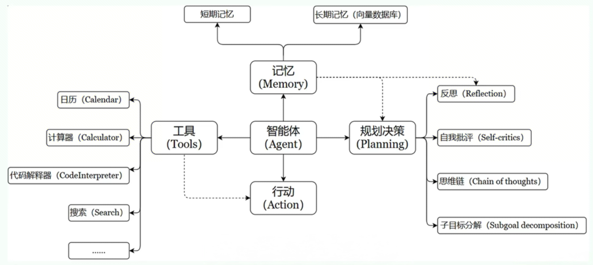

# 智能体

## 智能体（AI Agent）概述

### 古早理解

* 智能体（AI Agent、人工智能代理）的概念最早在1986年由“AI之父”马文·明斯基在《意识社会》中提出。

* 明斯基定义的智能体的核心要素：
  - 分布式智能体集合
    * 智能体由大量简单独立的功能模块组成，彼此协作完成复杂功能
  - 层级协作机制
    * 低级智能体负责感知运动等基本功能，高级智能体负责协调低级智能体推理和决策
  - 无中央控制
    * 没有统一的中央处理器

### 现代理解

* PPT讲
    * 对智能体的理解，我看了看相关的资料，可以追溯到23年6月份，openai的元老叫翁丽莲，这也是毕业于北大的一个华人，他首次提到了现代agent的一个架构，被广泛的认可
    * 这是相关的一段描述和文章的链接，我就不过多去描述这个文字了，他在这个博客当中就提到了这样的一个架构
    * 这个智能体的话呢，这里就提到了它的几个要素，比如说记忆，工具，规划决策，行动，这几个要素结合在一起构成现代版的智能体
    * 那么接下来的话呢，我们就分别的介绍一下这几个要素，便于我们去构建自己的智能体，所以知其然知其所以然
    * 首先呢我们来说这个核心要素一，毫无疑问，大语言模型，智能体的大脑就是一个大语言模型组成的，就像现在比较火的deepseek-r1一样
    * 大模型一方面他能存储知识和记忆，另外一方面呢，是进行信息的处理和决策，而且它还能够呈现给我们推理和规划的一个过程，就行咱们在使用R1的时候，我们看到它能够呈现出来这个推理过程是一样的
    * 接下来我说说核心要素2，叫做记忆，这个智能体就跟人一样，它也能够记住学到的知识和交互的习惯，记忆又分为短期记忆和长期记忆，短期记忆呢，就是存储单次对话周期的上下文信息，它会受限于模型的上下文窗口长度，而长期记忆呢，是可以跨多个任务或时间周期，可储存并调用核心知识，我们可以通过模型参考微调（固化知识）、知识图谱（结构化语义网格）或向量数据库（相似性检索）等方式实现，比如说知识库就是用到了向量数据库
    * 第三个叫做工具的使用，智能体可以通过API、数据库等工具来弥补自身的一个短板，比如dify可以添加各种各样的插件来获取想要的数据
    * 第四个是规划决策，我们喂给智能体提示词，包括任务内容、目标、背景知识，智能体会把任务进行拆解进行处理，还可以进行反思和自省的策略
    * 最后一个是行动，这就涉及到调用具体的像软件接口的操作或者物理的交互
    * 这些要素合在一起构成了智能体，而且多个智能体还可以协作来完成复杂的需求

* 智能体（AI Agent）是一种能够自主行动、感知环境、做出决策并与环境交互的计算机系统或实体，通常依赖大型语言模型作为其核心决策和处理单元，具备独立思考、调用工具去逐步完成给定目标的能力。

* [文章链接] (https://lilianweng.github.io/posts/2023-06-23-agent/)

## 智能体的架构
* 通过几个要素结合在一起构成现代版的智能体
  - 记忆
  - 工具
  - 规划决策
  - 行动
  

## 智能体核心要素
* 大模型
  - 大模型作为智能体的大脑：提供推理、规划和知识理解能力，是AI Agent的决策中枢
* 记忆
  - 短期记忆：存储单次对话周期的上下文信息，属于临时信息存储机制。受限于模型的上下文窗口长度
  - 长期记忆：可以跨多个任务或时间周期，可储存并调用核心知识，非即时任务
  - 长期记忆，可以通过模型参考微调（固化知识）、知识图谱（结构化语义网格）或向量数据库（相似性检索）等方式实现
* 工具使用
  - 调用外部工具（如API、数据库等）扩展能力边界
* 规划决策
  - 通过任务分解、反思与自省框架实现复杂任务处理。例如利用思维链将目标拆解为子任务，并通过反馈优化策略
* 行动
  - 实际执行决策的模块涵盖软件接口操作（如自动订票）和物理交互（如机器人执行搬运）。比如：检索、推理、编程等

## RAG的理解

* RAG(Retrieval-Augmented Generation，检索增强生成)，是一种结合信息检索（Retrieval）与文本生成（Generation）的技术，旨在提升大预言模型在回答专业问题时的准确性和可靠性
* 场景1：
  - 大语言模型（LLM）的训练依赖于网络上海量公开的静态数据，而某些特定领域（如企业内部资料、专业技术文档等）的数据通常不会作为公开的训练数据，导致模型在面对这些领域的查询时，可能因缺乏足够的信息而生成不准确甚至虚构的回答
  - 解决方案：
    * RAG技术通过引入向量数据库作为外部知识源，将模型缺失的知识以结构化的形式提供
  - 个人知识库其实就是RAG技术的一个应用

* 场景2：
  - 随着LLM规模扩大，训练成本与周期相应增加。因此，包含最新信息的数据难以融入模型训练过程，无法及时反映最新的信息或动态变化。导致LLM在应对诸如“请推荐当前热门电影”等时间敏感性问题
  - 解决方案：
    * 提供联网搜索功能

## 智能体的三个发展阶段
* 阶段1：提示词立人设
  - GPTS、Cherry-Studio、豆包等通过提示词，做一个阉割版的智能体，直接和LLM交互

* 阶段2：工作流
  - 定义工作流，每一步可以指定不同的模型，应用就会按照我们设定的流程执行任务
  - 面向过程

* 阶段3：real智能体
  - 智能体根据人类设定的目标，自主进行任务拆分，工具选择，进度控制，实现目标后自主结束工作

## 高阶智能体

### 通过Cline体现智能体
* Cline是VS Code的一个插件，它可以通过调用LLM的API实现自动化开发，可被视为用于开发的智能体
* 安装步骤：
  * VS Code的插件库中搜索Cline，安装
  * 安装完成后，点击左下角的Cline图标，进入Cline设置界面
  * API Provider选择OpenAI Compatible
  * base URL填入硅基流动的API链接
  * API Key填入硅基流动的API Key
  * 在硅基流动的模型广场选择并复制模型
  * Model ID填入复制的模型
  * 点击保存
  * 点击对话输入框附件的小箭头，勾选需要的配置
* 项目1：动态查询某个城市的天气情况
  - 需求：帮我实现一个weather.py程序，可以通过高德提供的API-key获取城市天气
  - 步骤：
    * 打开VS Code，创建一个新的项目
    * Cline对话框输入：帮我实现一个weather.py程序，可以通过高德提供的API-key获取城市天气
    * 在生成好的代码中，填入高德的API-key
* 项目2：多城市天气对比（有前后端页面）
  - 需求：基于高德提供的天气接口实现一个前后端分离的多城市天气对比项目
  - 步骤：
    * 打开VS Code，创建一个新的项目
    * Cline对话框输入
      - 基于高德提供的天气接口实现一个前后端分离的项目，使用Python Flask框架完成后端开发，使用前端三剑客HTML、CSS和JavaScript完成前端开发。
      - 目标：在本地7777端口启动Web服务，通过浏览器访问该端口。前端页面提供两个文本框，分别提示用户输入两个待查询城市的名称，提供一个按钮，用户点击按钮时，后端调用天气接口查询双城天气，前端页面分别展示两个城市的天气，要求输出对称。此外，还要大模型基于两个城市天气查询结果从不同角度对比。在前端展示天气对比概述。布局要尽可能美观。
    * 在生成好的代码中，填入高德的API-key

