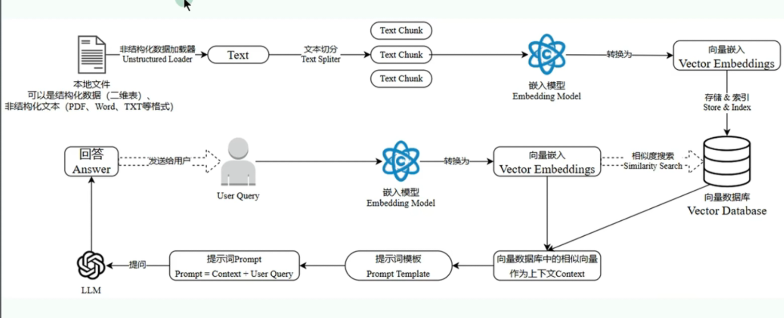

# 搭建企业私有/个人知识库
* 平台
  - AnythingLLM
  - Dify
  - Coze
  - MaxKB
  - 秘塔搜索
  - 知乎直达
  - Cherry-Studio
  - Ima

## Cherry-Studio + 硅基流动 + DeepSeek-R1

### 搭建步骤

* 注册硅基流动账号：[硅基流动] (https://siliconflow.cn/zh-cn/)
* 登录
* 点击左侧的“API密钥”
* 点击“新建API密钥”
* 填写密钥名称并点击“新建密钥”
* 下载并安装cherry-studio客户端
    * 网址：[cherry-studio] (https://cherry-ai.com/)
* 打开客户端
* 点击左下角“设置”
* 打开硅基流动
    * 填入API密钥
    * 选择DeepSeek-R1、DeepSeek-V3、BAAI/bge-m3、Pro/BAAI/bge-m3模型
* 点击左侧的“知识库”
* 点击“添加”
* 输入名称
* 嵌入模型选择BAAI/bge-m3（免费）或Pro/BAAI/bge-m3（收费）
* 点击确定
* 将需要的文件上传到知识库
* 可以搜索知识库
* 在对话框可以选择个人知识库提问

## ima + DeepSeek-R1

### 搭建步骤

* 下载并安装ima客户端
    * 网址：[腾讯ima] (https://ima.qq.com/)
* 点击左侧“知识库”按钮
* 创建共享“知识库”
    * 填写名称
    * 点击“确定”
* 点击“添加文件”上传知识库
* 在右侧对话框选择个人知识库提问
* 可以把知识库分享给其他人

## 知识库执行流程

1. 把相关的数据进行文本的切分
2. 使用嵌入模型把数据存储到对应的向量数据库当中
3. 进行数据持久化
4. 将提示词基于向量嵌入的方式去向量数据库进行相似度检索
5. 将检索完以后的数据作为上下文信息，输入给大模型进行处理
6. 大模型进行处理以后，返回给用户